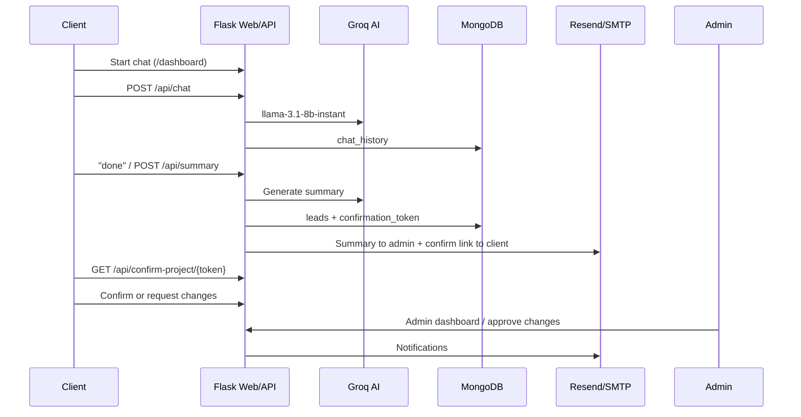

# AI Lead Automation — Complete Project Analysis Report

**Purpose:** This document describes the entire `ai-lead-automation` codebase so you can paste it into ChatGPT (or another assistant) and rebuild the product in **Android Studio** while keeping the same backend behavior.

**Repository path:** `D:/ai-lead-automation`  
**Analysis date:** May 15, 2026

---

## 1. Executive summary — what you are building

**AI Lead Automation** is an **AI-powered CRM / lead qualification platform** for software agencies or freelancers. It automates the journey from first contact to signed project.

### Core value proposition

| Actor | What they do |
|--------|----------------|
| **Prospect / Client** | Chats with AI about project needs, receives email replies, gets a structured project summary + cost estimate, confirms or requests changes via token links |
| **Admin** | Views all leads, approves/rejects change requests, confirms projects, manages other admins, uses analytics/memory/context dashboards (mostly mock data today) |

### End-to-end business flow



---

## 2. Technology stack

| Layer | Technology |
|--------|------------|
| Backend | **Python 3**, **Flask** (~3,900 lines in monolithic `app.py`) |
| Real-time | **Flask-SocketIO** (WebSockets) |
| Database | **MongoDB Atlas** via **PyMongo** (database name: `aileads`) |
| AI | **Groq API** — model `llama-3.1-8b-instant` |
| Email | **Resend API** + fallback **SMTP** (`smtplib`) |
| Auth | Flask **sessions** (cookies), **bcrypt** passwords for admins |
| Security libs | `flask-cors`, `flask-limiter`, `flask-talisman` (partially wired), custom `middleware/auth.py`, `config/security.py` |
| Frontend | **Jinja2 HTML templates**, inline CSS, some Bootstrap on landing |
| Static JS | `static/js/main.js` — shared API helper |
| Entry points | `run.py` (uses `app.run`) vs `app.py` `__main__` (uses `socketio.run`) |

### Python dependencies (`requirements.txt`)

```
flask, python-dotenv, flask-cors, groq, resend, pymongo,
python-dateutil, bcrypt, flask-limiter, flask-talisman,
email-validator, pyotp, flask-socketio, python-socketio, python-engineio
```

---

## 3. Project folder structure

```
ai-lead-automation/
├── app.py                    # MAIN: routes, DB, AI, email, sockets (~3900 lines)
├── run.py                    # Alternate runner (Flask app.run, NOT SocketIO)
├── health_check.py           # HTTP health tester for local server
├── requirements.txt
├── .env                      # Secrets (NOT in git — you have it locally)
│
├── config/
│   └── security.py           # Password policy, headers, session config
│
├── middleware/
│   └── auth.py               # @require_auth, @require_role decorators
│
├── src/
│   └── services/
│       └── context_service.py  # BROKEN: imports deleted modules
│
├── static/
│   ├── css/style.css
│   └── js/main.js            # API wrapper, notifications, charts utils
│
└── templates/                # 17 HTML pages (see Section 8)
```

### Deleted / broken modular code (important)

Git history shows these were **removed** but `context_service.py` still imports them:

- `src/config/settings.py`
- `src/models/admin.py`, `lead.py`, `memory.py`, `database.py`
- `src/routes/*` (admin, lead, memory, context)
- `src/services/lead_service.py`, `memory_service.py`, `vector_service.py`, `scoring_service.py`
- `src/utils/ai_service.py`, `email_service.py`, `embeddings.py`

**Reality today:** Almost everything lives in **`app.py`**. Memory/context/analytics APIs return **hardcoded mock JSON**, not real DB data.

### Missing files referenced by code

| Referenced | Status |
|------------|--------|
| `templates/client_login.html` | **MISSING** — route `/client_login` will 500 |
| `admin_management.html` (root) | **MISSING** — route `/admin_management` broken |
| `chat_interface.html` (root) | **MISSING** — route `/chat` broken |

---

## 4. Architecture (current state)

```
┌─────────────────────────────────────────────────────────────┐
│                     Browser / Future Android App           │
└───────────────────────────┬─────────────────────────────────┘
                            │ HTTP JSON + Cookies (session)
                            │ WebSocket (Socket.IO)
┌───────────────────────────▼─────────────────────────────────┐
│  Flask app.py                                                │
│  • Page routes → render_template()                           │
│  • /api/* → JSON                                             │
│  • SocketIO rooms: lead_{id}, admin_dashboard                  │
└───────┬─────────────────┬─────────────────┬─────────────────┘
        │                 │                 │
   MongoDB Atlas      Groq API          Resend / SMTP
   (aileads DB)       (chat/summary)    (notifications)
```

**Android implication:** You will mostly consume **`/api/*` JSON endpoints**. Session cookies or token-based auth must be designed explicitly for mobile (Flask sessions work poorly on Android unless you use a `CookieJar` on OkHttp/Retrofit).

---

## 5. Environment variables

| Variable | Required | Purpose |
|----------|----------|---------|
| `FLASK_SECRET_KEY` | Yes | Flask session signing |
| `MONGODB_URI` | Yes | MongoDB Atlas connection string |
| `GROQ_API_KEY` | Yes | AI chat & summaries |
| `RESEND_API_KEY` | Yes | Primary email |
| `EMAIL_FROM` | Optional | Sender address (default `onboarding@resend.dev`) |
| `SMTP_USERNAME` | Optional | Gmail/etc fallback |
| `SMTP_PASSWORD` | Optional | SMTP app password |
| `ADMIN_EMAIL` | Optional | Admin notifications (default hardcoded email in code) |
| `SESSION_TIMEOUT_MINUTES` | Optional | Default 30 |
| `FLASK_ENV` | Optional | `production` toggles secure cookies |

`run.py` warns if any of: `FLASK_SECRET_KEY`, `GROQ_API_KEY`, `RESEND_API_KEY`, `MONGODB_URI` are missing.

---

## 6. MongoDB data model

**Database:** `aileads`

### Collections & indexes (created on startup)

| Collection | Indexes | Purpose |
|------------|---------|---------|
| `leads` | `email`, `timestamp`, `name` | Main CRM records |
| `chat_history` | `(email, timestamp)`, `session_id` | Per-message chat log |
| `summaries` | `email`, `timestamp`, `status` | Defined but lightly used |
| `admins` | unique `username`, unique `email`, `created_at` | Admin users |
| `messages` | *(no index in code)* | Admin↔client threaded messages |

### Lead document — fields over lifecycle

**On create** (`save_lead_to_mongodb`):

```json
{
  "name": "string",
  "email": "string",
  "message": "string",
  "timestamp": "ISODate",
  "ai_reply": "string | null",
  "is_summary": false,
  "status": "new"
}
```

**After conversation summary** (additional fields):

```json
{
  "is_summary": true,
  "project_details": "markdown summary text",
  "cost_estimate": "string (parsed from summary)",
  "confirmation_token": "url-safe token",
  "confirmation_expiry": "ISODate (+7 days)"
}
```

**Status values used in code/UI:**

| Status | Meaning |
|--------|---------|
| `new` | Fresh lead |
| `changes_requested` | Client asked for changes |
| `changes_approved` | Admin approved changes |
| `changes_rejected` | Admin rejected changes |
| `clarification_requested` | Admin needs more info |
| `client_confirmed` | Client clicked confirm on token link |
| `confirmed` | Admin final confirmation |

**Change request object** (two shapes — inconsistency):

- Form flow: `change_request.changes`, `change_request.budget_changes`
- API flow: `change_request.requested_changes`, `change_request.budget_changes`

**Other optional fields:** `admin_response`, `admin_notes`, `internal_notes`, `admin_response_date`, `approved_by`, `rejected_by`, `client_confirmed_at`, `admin_confirmed_at`, `client_session_id`, `last_session`

### Chat history document

```json
{
  "email": "string",
  "session_id": "string",
  "message": "string",
  "role": "user | assistant",
  "name": "string | null",
  "ai_reply": "string | null",
  "timestamp": "ISODate"
}
```

### Admin document

```json
{
  "username": "string",
  "email": "string",
  "password": "bcrypt hash",
  "role": "super_admin | admin | viewer",
  "is_active": true,
  "created_at": "ISODate",
  "last_login": "ISODate | null",
  "login_attempts": 0,
  "reset_token": "optional",
  "reset_expiry": "optional"
}
```

### Message document (real-time chat)

```json
{
  "lead_id": "ObjectId",
  "sender_type": "admin | client",
  "sender_name": "string",
  "sender_email": "string",
  "message": "string",
  "timestamp": "ISODate",
  "read": false
}
```

---

## 7. Complete API reference

**Base URL (local):** `http://127.0.0.1:5000`  
**Content-Type:** `application/json` for POST bodies  
**Auth:** Flask **session cookie** after admin login — many routes do **not** enforce auth even when they should.

### 7.1 Health & test

| Method | Endpoint | Auth | Request | Response |
|--------|----------|------|---------|----------|
| GET | `/api/db-status` | No | — | `{ database, timestamp, collections }` |
| GET | `/api/test` | No | — | `{ status, message, database }` |

### 7.2 Public / client lead & chat

| Method | Endpoint | Body | Response |
|--------|----------|------|----------|
| POST | `/api/lead` | `{ name, email, message }` | `{ status, ai_reply, email_sent, lead_id }` |
| POST | `/api/chat` | `{ message, email?, name?, session_id?, conversation_history[] }` | `{ status, ai_reply }` or summary object if user says "done" |
| POST | `/api/summary` | `{ name, email, conversation_history[] }` | `{ status, summary }` — **does not** send emails (unlike chat completion path) |

**`conversation_history` item shape:**

```json
{ "role": "user" | "assistant", "content": "message text" }
```

### 7.3 Leads (admin)

| Method | Endpoint | Notes |
|--------|----------|-------|
| GET | `/api/leads` | Returns **array** of leads (not wrapped in `{status}`) |
| DELETE | `/api/lead/<int:index>` | Deletes by **sorted index**, not MongoDB `_id` |

**BUG:** Admin UI calls `DELETE /api/lead/{lead._id}` (ObjectId string) but backend expects **integer index** → delete fails.

### 7.4 Admin authentication

| Method | Endpoint | Body | Response |
|--------|----------|------|----------|
| POST | `/api/admin/register` | `{ username, email, password, role }` | 201 + `admin_id` |
| POST | `/api/admin/login` | `{ username, password }` | Sets session cookie; `{ redirect, user }` |
| POST | `/api/admin/logout` | — | Clears session |
| POST | `/api/admin/forgot-password` | `{ email }` | Always success message (security) |
| GET/POST | `/api/admin/reset-password/<token>` | POST: `{ password }` | HTML page or JSON |
| GET | `/api/admin/list` | — | Requires `super_admin` or `admin` role |
| DELETE | `/api/admin/<admin_id>` | — | Requires `super_admin` |

**BUG:** `admin_register.html` calls `GET /api/csrf-token` — **endpoint does not exist**.

**BUG:** `list_admins` / `delete_admin` use `@AuthMiddleware` but login never sets `session['last_activity']` required by middleware — may cause session timeout issues.

### 7.5 Project confirmation & changes (token-based)

| Method | Endpoint | Behavior |
|--------|----------|----------|
| GET/POST | `/api/confirm-project/<token>` | GET: HTML form; POST: sets `client_confirmed` |
| GET/POST | `/api/request-changes/<token>` | GET: HTML form; POST: form fields `changes`, `budget_changes` |
| POST | `/api/submit-change-request/<token>` | JSON: `{ requested_changes, budget_changes }` |
| POST | `/api/admin-confirm-project/<lead_id>` | Admin final confirm — **BUG:** queries `_id` as string, not `ObjectId` |

### 7.6 Change approval (admin) — **DUPLICATE ROUTES**

These paths are registered **twice** in `app.py`. Flask uses the **last** definition:

| Method | Endpoint | Final behavior (2nd handler) |
|--------|----------|------------------------------|
| POST | `/api/approve-changes/<lead_id>` | Requires `session.is_authenticated`; SocketIO emit |
| POST | `/api/reject-changes/<lead_id>` | Same |
| POST | `/api/request-clarification/<lead_id>` | Only first handler exists (no duplicate) |

First handlers (no auth check) are **overwritten** — dead code.

**Request body (admin dashboard):**

```json
{
  "admin_response": "string",
  "internal_notes": "string (approve/reject only in 2nd handler)"
}
```

### 7.7 Real-time messaging

| Method | Endpoint | Body |
|--------|----------|------|
| POST | `/api/send-message/<lead_id>` | `{ message, sender_type: "admin"\|"client" }` |
| GET | `/api/get-messages/<lead_id>` | Returns `{ status, messages[] }` |

### 7.8 Client session

| Method | Endpoint | Body |
|--------|----------|------|
| POST | `/api/client/register` | `{ email, name }` |
| POST | `/api/client/logout` | — |

### 7.9 Dashboard APIs (mostly **MOCK DATA**)

| Method | Endpoint | Real data? |
|--------|----------|------------|
| GET | `/api/memory/stats` | **No** — fake counts |
| POST | `/api/memory/clear-old` | Stub success |
| POST | `/api/memory/optimize` | Stub |
| GET | `/api/memory/export` | Stub JSON |
| GET | `/api/context/stats` | **No** — mock |
| GET | `/api/context/search?q=` | Mock array |
| POST | `/api/context/rebuild` | Stub |
| POST | `/api/context/analyze` | Stub |
| GET | `/api/context/export` | Stub |
| GET | `/api/analytics/stats?period=week\|month` | **No** — mock KPIs/charts |
| GET | `/api/analytics/export?period=` | Stub |

### 7.10 Endpoints called by UI but **NOT IMPLEMENTED**

| Called from | Missing endpoint |
|-------------|------------------|
| `client_chat.html` | `GET /api/chat-history/<email>` |
| `client_chat.html` | `POST /api/send-client-message` |
| `admin_register.html` | `GET /api/csrf-token` |

### 7.11 HTML page routes (not needed for native Android UI)

| Route | Template |
|-------|----------|
| `/` | `welcome.html` |
| `/dashboard` | `dashboard.html` — **main client AI chat** |
| `/landing` | `landing.html` |
| `/admin_login` | `admin_login.html` |
| `/admin_dashboard` | `admin_dashboard.html` |
| `/admin_register` | `admin_register.html` |
| `/memory_dashboard` | `memory_dashboard.html` |
| `/context_dashboard` | `context_dashboard.html` |
| `/analytics_dashboard` | `analytics_dashboard.html` |
| `/client_chat` | `client_chat.html` |
| `/client_login` | **MISSING template** |

---

## 8. WebSocket / Socket.IO events

**Library:** Socket.IO client must connect to same host (e.g. `http://127.0.0.1:5000`).

**Critical bug:** In `app.py`, `@socketio.on(...)` handlers are defined **after** `if __name__ == '__main__': socketio.run(...)`. When you run `python app.py`, `socketio.run` **blocks forever** and handlers **never register**. When you use `run.py` (`from app import app`), handlers **do** register because `__name__` is not `__main__`.

| Event (client → server) | Payload | Server action |
|-------------------------|---------|---------------|
| `connect` | — | Emits `connection_response` |
| `join_lead_room` | `{ lead_id, user_type }` | Join room `lead_{id}` |
| `join_admin_dashboard` | — | Join `admin_dashboard` |
| `leave_lead_room` | `{ lead_id }` | Leave room |
| `send_message` | `{ lead_id, message, sender_type }` | Emit `message_received` |
| `change_request_submitted` | `{ lead_id, client_name, requested_changes }` | Emit to admins |
| `approve_changes_realtime` | `{ lead_id, admin_response }` | Emit to client room |
| `reject_changes_realtime` | `{ lead_id, admin_response }` | Emit to client room |
| `typing_indicator` | `{ lead_id, is_typing, user_type }` | Emit `user_typing` |

| Event (server → client) | When |
|-------------------------|------|
| `new_change_request` | Client submits changes |
| `changes_approved` / `changes_rejected` | Admin acts via REST |
| `new_message` | REST `/api/send-message` |
| `message_received` | Socket `send_message` |
| `new_change_request_realtime` | Socket bridge |
| `changes_approved_realtime` / `changes_rejected_realtime` | Socket bridge |

**Android:** Use [socket.io-client-java](https://github.com/socketio/socket.io-client-java) or poll REST `/api/get-messages/<lead_id>` if you skip WebSockets initially.

---

## 9. UI screens (templates) — map to Android activities

| Screen | File | Primary APIs |
|--------|------|--------------|
| Welcome / home | `welcome.html` | Links to dashboard, admin |
| Client AI chat | `dashboard.html` | `POST /api/chat`, `POST /api/summary` (hardcoded `http://127.0.0.1:5000`) |
| Admin login | `admin_login.html` | `POST /api/admin/login`, forgot-password |
| Admin CRM | `admin_dashboard.html` | `GET /api/leads`, approve/reject/clarify, delete (broken ID) |
| Admin register | `admin_register.html` | `POST /api/admin/register` |
| Password reset | `admin_reset_password.html` | `POST /api/admin/reset-password/{token}` |
| Marketing landing | `landing.html` | Static |
| Memory admin | `memory_dashboard.html` | Mock memory APIs |
| Context admin | `context_dashboard.html` | Mock context APIs |
| Analytics admin | `analytics_dashboard.html` | Mock analytics APIs |
| Confirm project | `confirm_project.html` | Token link from email |
| Request changes | `request_changes.html` | Form POST to token URL |
| Client chat (post-sale) | `client_chat.html` | **Broken** — missing APIs |
| Base layout | `base.html` | Nav shell for Bootstrap pages |

**Design language:** Purple gradient (`#667eea` → `#764ba2`), glassmorphism cards, ChatGPT-style chat on dashboard.

---

## 10. AI behavior (Groq)

| Use case | Model | max_tokens | Trigger |
|----------|-------|------------|---------|
| Quick lead reply | `llama-3.1-8b-instant` | 50 | `POST /api/lead` |
| Requirements chat | same | 500 | `POST /api/chat` |
| Full summary | same | 2000 | Chat completion keywords or `/api/summary` |

**Fallback:** If Groq fails or key missing, canned text responses are returned.

**System prompt themes:** Business assistant, markdown formatting, no leading whitespace on lines, gather requirements, generate summary on "done/complete/finished".

---

## 11. Email flows

1. **Instant lead reply** — `send_email_to_user` after `/api/lead`
2. **Conversation complete** — admin report + client confirmation link (`send_final_report_to_admin`, `send_confirmation_to_client`)
3. **Password reset** — `send_password_reset_email`
4. **Change request** — notify admin
5. **Approve/reject changes** — HTML emails via SMTP helper

Emails embed links like: `http://127.0.0.1:5000/api/confirm-project/{token}` — **must be configurable** for production/Android (use your deployed API base URL).

---

## 12. Known bugs & why you hit API issues

This section explains the problems you described.

### 12.1 Frontend/backend mismatches

| Issue | Detail |
|-------|--------|
| Delete lead | UI: `DELETE /api/lead/{mongoId}` — API: `DELETE /api/lead/{integerIndex}` |
| Client chat | Calls non-existent `/api/chat-history/`, `/api/send-client-message` |
| CSRF | Register page expects `/api/csrf-token` — not implemented |
| Hardcoded host | `dashboard.html` uses `http://127.0.0.1:5000/api/chat` — fails on device/emulator unless you use `10.0.2.2:5000` (Android emulator) or LAN IP |
| `admin_confirm_project` | Uses string `lead_id` without `ObjectId(lead_id)` — lookup fails |
| Duplicate routes | `approve-changes` / `reject-changes` registered twice |
| `save_lead` AI bug | If Groq works, `ai_reply = response...` may run outside inner try in some branches (logic error risk) |

### 12.2 Auth inconsistencies

- `GET /api/leads` — **no auth** (anyone can read all leads)
- `POST /api/chat` — **no auth** (intentional for public chat)
- Admin login sets `is_authenticated` but not always `last_activity` for middleware
- Android cannot use session cookies the same way as browser without explicit cookie handling

### 12.3 Infrastructure

- `run.py` uses `app.run()` — **no WebSocket support**
- `app.py` direct run may **skip Socket.IO handlers** (ordering bug)
- `context_service.py` will **crash if imported** (missing dependencies)
- Missing `client_login.html`, `admin_management.html`

### 12.4 Data inconsistencies

- `change_request` field uses different property names in different flows
- Client register **upserts** into `leads` collection (mixes prospects with CRM leads)

---

## 13. User journeys (for Android screen design)

### Journey A — New prospect (main flow)

1. **Splash / Welcome** → enter name + email
2. **Chat screen** — maintain `conversation_history` in ViewModel
3. On each send → `POST /api/chat` with `{ message, name, email, session_id, conversation_history }`
4. Append assistant reply to history
5. When user taps "Finish" → either send "done" in chat (triggers server summary + emails) or call `POST /api/summary` then show summary locally
6. Show "check your email" for confirmation link (deep link: `yourapp://confirm?token=...` or WebView to server URL)

### Journey B — Admin

1. **Login** → `POST /api/admin/login` — store session cookie in `CookieManager`
2. **Leads list** → `GET /api/leads`
3. **Lead detail** — show message, status, change_request
4. **Actions** — `POST /api/approve-changes/{id}`, reject, clarification
5. **Messaging** — `GET/POST /api/get-messages|send-message/{id}` + optional Socket.IO
6. **Logout** → `POST /api/admin/logout`

### Journey C — Client post-confirmation chat

1. `POST /api/client/register` with email/name
2. Poll or WebSocket messages for assigned `lead_id`
3. *(Currently broken on web until missing endpoints are added)*

---

## 14. Android Studio migration plan (recommended)

### 14.1 Recommended app structure

```
app/
├── data/
│   ├── remote/     Retrofit API interfaces, SocketIO client
│   ├── local/      Room DB for offline chat cache (optional)
│   └── repository/
├── domain/         Use cases: SendChat, LoadLeads, LoginAdmin
├── ui/
│   ├── client/     Welcome, Chat, Summary
│   ├── admin/      Login, LeadsList, LeadDetail, Messages
│   └── common/
└── di/             Hilt modules
```

### 14.2 Libraries to use

| Need | Library |
|------|---------|
| HTTP | **Retrofit 2** + **OkHttp** + logging interceptor |
| JSON | **Moshi** or Gson |
| Session cookies | `JavaNetCookieJar` / persist in EncryptedSharedPreferences |
| WebSocket | **socket.io-client** (Java) OR skip and poll messages every 3–5s |
| UI | **Jetpack Compose** or XML + Material 3 |
| Async | **Kotlin Coroutines** + Flow |
| DI | **Hilt** |
| Local cache | **Room** (optional) |

### 14.3 Base URL configuration

```kotlin
// Emulator → host machine
const val BASE_URL = "http://10.0.2.2:5000/"

// Physical device on same WiFi
const val BASE_URL = "http://192.168.x.x:5000/"
```

Build `BuildConfig.API_BASE_URL` per build flavor (debug/release).

### 14.4 Retrofit interface sketch

```kotlin
interface LeadApi {
    @POST("api/chat")
    suspend fun chat(@Body body: ChatRequest): ChatResponse

    @POST("api/summary")
    suspend fun summary(@Body body: SummaryRequest): SummaryResponse

    @POST("api/lead")
    suspend fun createLead(@Body body: LeadRequest): LeadResponse

    @GET("api/leads")
    suspend fun getLeads(): List<LeadDto>

    @POST("api/admin/login")
    suspend fun adminLogin(@Body body: LoginRequest): LoginResponse
}
```

Enable `usesCleartextTraffic="true"` in debug for HTTP localhost.

### 14.5 Auth strategy for mobile (important)

**Option A (minimal change):** Keep Flask sessions — OkHttp `CookieJar` saves `session` cookie from login response.

**Option B (better for production):** Add JWT endpoints to Flask (`/api/admin/login` returns `access_token`) — requires backend work.

For your current backend, start with **Option A**.

### 14.6 What to build first (MVP order)

1. Config + Retrofit + health check `GET /api/test`
2. Client chat (`/api/chat` + local history)
3. Admin login + leads list
4. Lead detail + change approval APIs
5. Deep link / WebView for email confirmation tokens
6. Socket.IO (optional phase 2)
7. Memory/context/analytics — **skip or mock** until backend is real

### 14.7 Backend fixes you should do before/during Android work

1. Add `DELETE /api/lead/by-id/<objectId>` or fix UI to use index
2. Implement `/api/chat-history/<email>` and `/api/send-client-message` OR remove client_chat features
3. Add `client_login.html` or remove route
4. Fix duplicate `approve-changes` / `reject-changes` — keep one version
5. Protect `GET /api/leads` with `@AuthMiddleware.require_auth`
6. Replace hardcoded `127.0.0.1` in emails/dashboard with env `PUBLIC_BASE_URL`
7. Move Socket.IO handlers **above** `if __name__` or only start server from `run.py` with `socketio.run`
8. Fix `admin_confirm_project` to use `ObjectId(lead_id)`

---

## 15. Data models for Android (Kotlin data classes)

```kotlin
data class ChatRequest(
    val message: String,
    val email: String,
    val name: String,
    val session_id: String,
    val conversation_history: List<ChatMessage>
)

data class ChatMessage(
    val role: String,  // "user" | "assistant"
    val content: String
)

data class ChatResponse(
    val status: String,
    val ai_reply: String?,
    val is_summary: Boolean? = null,
    val lead_id: String? = null
)

data class LeadDto(
    val _id: String,
    val name: String,
    val email: String,
    val message: String,
    val timestamp: String?,
    val status: String?,
    val ai_reply: String?,
    val is_summary: Boolean?,
    val change_request: ChangeRequestDto?
)

data class ChangeRequestDto(
    val requested_changes: String? = null,
    val changes: String? = null,
    val budget_changes: String? = null,
    val requested_at: String? = null
)
```

---

## 16. Testing checklist (web + Android)

- [ ] `GET /api/db-status` → `database: connected`
- [ ] `POST /api/chat` with sample history
- [ ] Complete chat → verify email + MongoDB `confirmation_token`
- [ ] `GET /api/leads` after creating leads
- [ ] Admin login → cookie → protected routes
- [ ] `POST /api/approve-changes/{validObjectId}` with session
- [ ] Android emulator → `10.0.2.2:5000` connectivity
- [ ] Run `python health_check.py` with server up

---

## 17. Product vision statement (for ChatGPT context)

> Build an **AI Lead Automation** mobile app for a software services business. Prospects chat with an AI to define project requirements; the system stores leads in MongoDB, emails summaries and cost estimates, and lets clients confirm or request changes via secure tokens. Admins manage leads, approve changes, and chat with clients in real time. The existing backend is Flask + MongoDB + Groq + Resend; the Android app should consume REST JSON APIs (and optionally Socket.IO), using session cookies for admin auth, with a purple modern UI matching the web dashboards.

---

## 18. Quick reference — all routes in one list

**Pages:** `/`, `/dashboard`, `/landing`, `/admin_login`, `/admin_dashboard`, `/admin_register`, `/admin_management`, `/memory_dashboard`, `/context_dashboard`, `/analytics_dashboard`, `/chat`, `/client_login`, `/client_chat`

**APIs:**  
`/api/db-status`, `/api/test`, `/api/lead`, `/api/chat`, `/api/summary`, `/api/leads`, `/api/lead/<index>`,  
`/api/admin/register`, `/api/admin/login`, `/api/admin/logout`, `/api/admin/forgot-password`, `/api/admin/reset-password/<token>`, `/api/admin/list`, `/api/admin/<admin_id>`,  
`/api/confirm-project/<token>`, `/api/request-changes/<token>`, `/api/submit-change-request/<token>`, `/api/admin-confirm-project/<lead_id>`, `/api/download-summary/<lead_id>`,  
`/api/approve-changes/<lead_id>`, `/api/reject-changes/<lead_id>`, `/api/request-clarification/<lead_id>`,  
`/api/client/register`, `/api/client/logout`,  
`/api/send-message/<lead_id>`, `/api/get-messages/<lead_id>`,  
`/api/memory/*`, `/api/context/*`, `/api/analytics/*`

---

*This report reflects the actual state of the repo (monolithic Flask app, partial features, known endpoint bugs). For Android, prioritize **client chat + admin leads + change workflow**; treat memory/context/analytics as Phase 2 unless you implement real backend logic.*
